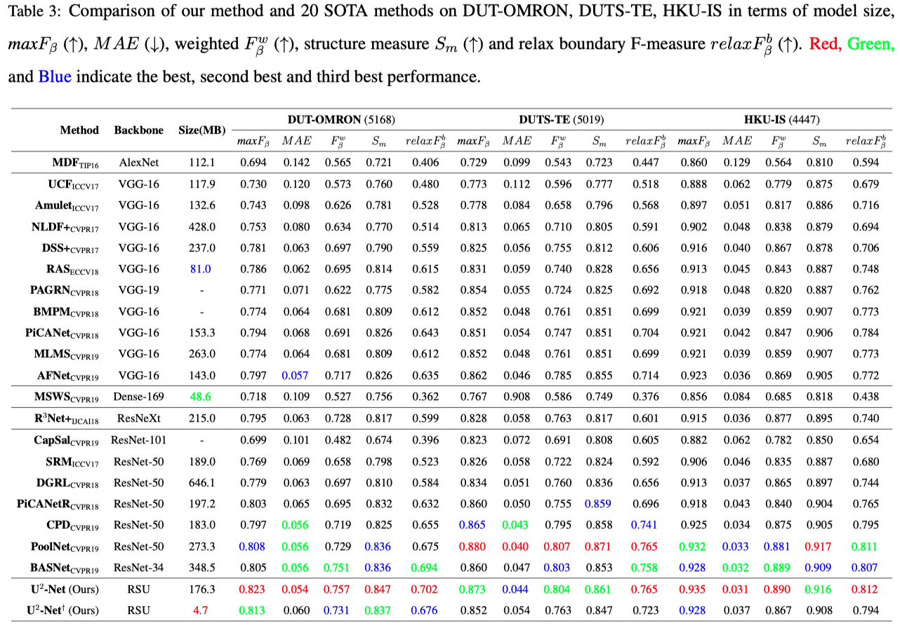
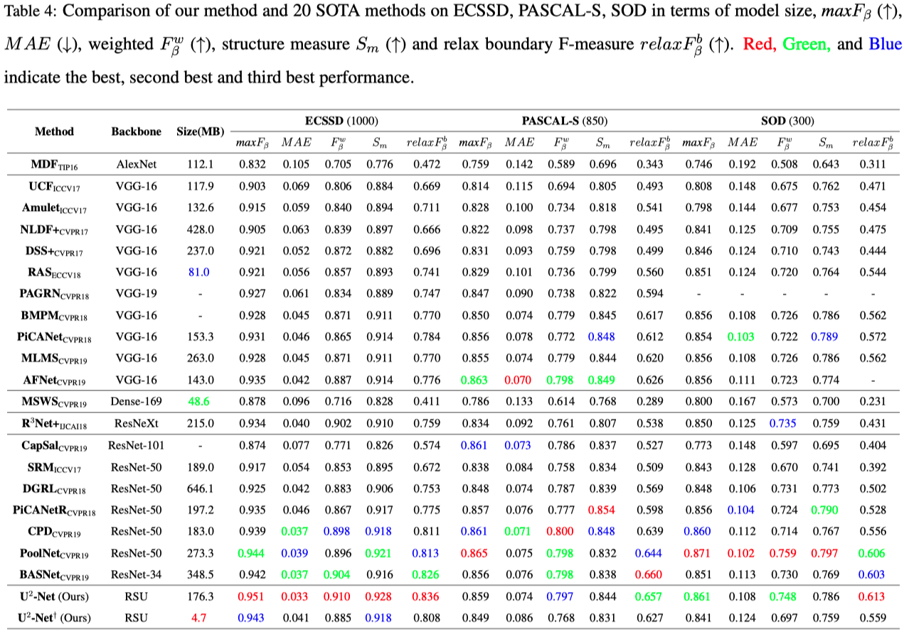

## Usage for salient object detection
1. Clone this repo
```
git clone https://github.com/NathanUA/U-2-Net.git
```
2. Download the pre-trained model u2net.pth (176.3 MB) from [**GoogleDrive**](https://drive.google.com/file/d/1ao1ovG1Qtx4b7EoskHXmi2E9rp5CHLcZ/view?usp=sharing) or [**Baidu Pan 提取码: pf9k**](https://pan.baidu.com/s/1WjwyEwDiaUjBbx_QxcXBwQ) or u2netp.pth (4.7 MB) from [**GoogleDrive**](https://drive.google.com/file/d/1rbSTGKAE-MTxBYHd-51l2hMOQPT_7EPy/view?usp=sharing) or [**Baidu Pan 提取码: 8xsi**](https://pan.baidu.com/s/10tW12OlecRpE696z8FxdNQ) and put it into the dirctory './saved_models/u2net/' and './saved_models/u2netp/'

3.  Cd to the directory 'U-2-Net', run the train or inference process by command: ```python u2net_train.py```
or ```python u2net_test.py``` respectively. The 'model_name' in both files can be changed to 'u2net' or 'u2netp' for using different models.  

 We also provide the predicted saliency maps ([u2net results](https://drive.google.com/file/d/1mZFWlS4WygWh1eVI8vK2Ad9LrPq4Hp5v/view?usp=sharing),[u2netp results](https://drive.google.com/file/d/1j2pU7vyhOO30C2S_FJuRdmAmMt3-xmjD/view?usp=sharing)) for datasets SOD, ECSSD, DUT-OMRON, PASCAL-S, HKU-IS and DUTS-TE.


## U<sup>2</sup>-Net Architecture


## Quantitative Comparison






## Qualitative Comparison


## Citation
```
@InProceedings{Qin_2020_PR,
title = {U2-Net: Going Deeper with Nested U-Structure for Salient Object Detection},
author = {Qin, Xuebin and Zhang, Zichen and Huang, Chenyang and Dehghan, Masood and Zaiane, Osmar and Jagersand, Martin},
journal = {Pattern Recognition},
volume = {106},
pages = {107404},
year = {2020}
}
```
